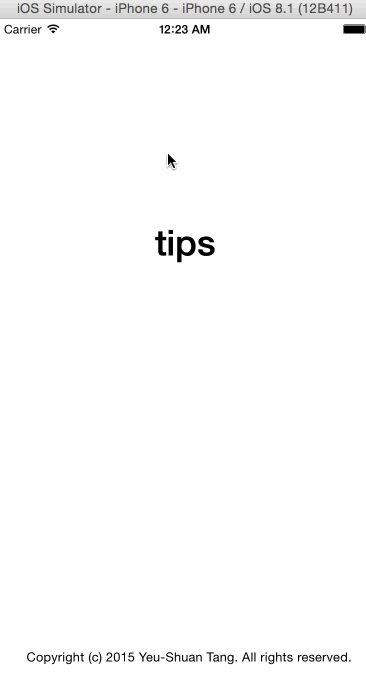

# TipCalculator

This is a Tip Calculator application for iOS submitted as the [pre-assignment](https://gist.github.com/timothy1ee/6858b706304a2397a7e2) requirement for Codepath.

Time spent: 5 hours

Completed:

* [x] Required: User can enter a bill amount, choose a tip percentage, and see the tip and total values.
* [x] Required: Settings page to change the default tip percentage.
* [ ] Optional: UI animations
* [ ] Optional: Remembering the bill amount across app restarts (if <10mins)
* [ ] Optional: Using locale-specific currency and currency thousands separators.

GIF created with [LiceCap](http://www.cockos.com/licecap/).